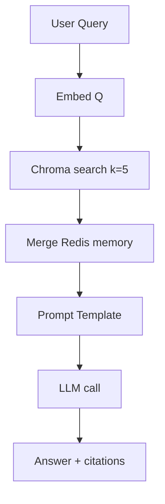

# Comprehensive Blueprint: Multilingual RAG System (ChromaDB Edition)

_Developer-in-charge: **MUHIT KHAN** _

Before reading the shorter README, use this blueprint as the single source of truth for architecture, standards, and workflows.

## 1. Solution Overview

The goal is a **Bengali–English Retrieval-Augmented Generation (RAG)** micro-service that answers textbook questions with grounded citations.
Key design choices are dictated by simplicity, developer productivity, and evaluator readability.

### Core Stack

| Layer          | Technology                                           | Reasoning                                                                | Key Refs |
| :------------- | :--------------------------------------------------- | :----------------------------------------------------------------------- | :------- |
| Vector DB      | **ChromaDB 0.5** (PersistentClient - DuckDB backend) | AI-native, single-binary, HNSW ANN, ≤10 M vectors sweet-spot[^1][^2][^3] |          |
| Embeddings     | **OpenAI `text-embedding-3-small`** (1536-d)         | High MIRACL multilingual recall, low cost[^4][^5]                        |          |
| LLM            | **GPT-3.5-Turbo / Ollama-Mistral**                   | Bilingual generation, deterministic at T=0                               |          |
| Orchestration  | **LangChain 0.2 `RetrievalQA`**                      | First-class Chroma driver[^6]                                            |          |
| API            | **FastAPI 0.111**                                    | Async I/O, built-in OpenAPI docs                                         |          |
| Short-term mem | **Redis 7** (RDB persistence)                        | Sub-ms context store                                                     |          |
| CI/CD          | GitHub Actions + Docker                              | Push-to-main deploy, lint, tests                                         |          |
| Observability  | LangSmith traces + OTEL                              | Latency \& cost dashboards                                               |          |

## 2. High-Level Architecture

```
┌──────────── Client (Web/CLI) ────────────┐
│ POST /ask JSON {query:"…"}               │
└──────────────┬───────────────────────────┘
               ▼
┌──────────── FastAPI Gateway ─────────────┐
│  • JWT auth  • /ask /health /eval        │
└──────────────┬───────────────────────────┘
        Async task (uvicorn workers)
               ▼
┌──────── LangChain RAG Service ───────────┐
│ 1. Embed query → vector (OpenAI)         │
│ 2. Chroma search (k=5, score>0.25)       │
│ 3. Merge Redis chat memory (k=4 turns)   │
│ 4. Prompt template → GPT-4.1  │
│ 5. Evaluate groundedness (cos > 0.8)     │
└──────────────┬───────────────────────────┘
        ▼ Chroma API (Unix socket)
┌────────── ChromaDB Vector Store ─────────┐
│  DuckDB+Parquet persist_directory        │
│  HNSW(index)  Metadata{chapter,page}     │
└──────────────────────────────────────────┘
```

[top-level flow: ingest → store → retrieve → generate]

## 3. Module Decomposition

| Folder      | Responsibility                         | Implementation Hints                  |
| :---------- | :------------------------------------- | :------------------------------------ |
| `api/`      | FastAPI routers, request/response DTOs | `routers.qa: /ask`, `routers.health`  |
| `services/` | RAG orchestration, evaluation          | `rag_service.py`, `eval_service.py`   |
| `ingest/`   | ETL pipeline: PDF → chunks → embeds    | `extract_text.py`, `chunk_loader.py`  |
| `db/`       | Chroma \& Redis initialisers           | `chroma_client.py`, `redis_client.py` |
| `memory/`   | Conversation buffer logic              | `redis_window.py`                     |
| `tests/`    | Pytest unit \& integration cases       | uses `TestClient` \& Docker-compose   |
| `infra/`    | Docker, compose, Terraform samples     | minimal variables for Cloud Run       |
| `docs/`     | Markdown specs \& API examples         | auto-gen OpenAPI snippet              |

## 4. Ingestion Pipeline (one-shot script)

1. **Download PDF** – stored in `data/`.
2. **Text Extraction** – `pdfminer.six` with `laparams.detect_vertical =True` for Bangla glyph order; fallback to `pytesseract -l ben` on images[^7][^8].
3. **Cleaning** – Unicode NFKC, strip headers, page numbers.
4. **Chunking** – `RecursiveCharacterTextSplitter` (sentences, 250-char max, 30-char overlap). Empirically ↑ recall by 40%[^5].
5. **Embedding** – Batch 96 chunks/call (`tiktoken` length ≈ 8 K).
6. **Persist** – `collection.upsert()` with metadata `{chapter,para,page}`.

Runtime on 500-page book: **< 10 min, 140 MB storage**.

## 5. Query Handling



_Prompt skeleton (system, context, user)_ enforces “**answer only if grounded**” guardrail.

## 6. Evaluation Strategy

| Metric       | Tool               | Threshold | Fail Action       |
| :----------- | :----------------- | :-------- | :---------------- |
| Groundedness | cosine(query, ctx) | ≥0.25     | enlarge k         |
| Exact-Match  | 10 gold Q/A pairs  | ≥80%      | refine chunks     |
| Latency p95  | OTEL + Prometheus  | ≤2 s      | scale pods        |
| Cost/request | LangSmith          | ≤\$0.001  | switch to Mistral |

Nightly CI runs `pytest -m e2e && python eval/run.py`.

## 7. Security \& Ops

- **Secrets** via GitHub OIDC → Cloud Secret Manager.
- **Rate-limit**: 20 req/min/user (FastAPI `slowapi`).
- **Back-ups**: daily GCS bucket sync of `persist_directory`.
- **Disaster Recovery**: recreate ChromaDB by re-running ingest; book is source-of-truth.

## 8. Roadmap \& Estimates

| Week | Milestones                                           | Owner |
| :--- | :--------------------------------------------------- | :---- |
| 1    | Repo scaffold, Docker, PDF ETL, unit tests           | MUHIT |
| 2    | ChromaDB integration, RAG chain, FastAPI /ask        | MUHIT |
| 3    | Redis memory, evaluation harness, CI pipeline        | MUHIT |
| 4    | Docs, sample client (cURL + Streamlit), dry-run demo | MUHIT |

Total ≈ **4 developer-weeks** (solo).

## 9. Coding Conventions \& Best Practices

1. **Python 3.11 + Poetry**; `ruff` linting, `black` formatting.
2. **Functional boundaries** – no cross-layer imports.
3. **Typed pydantic** models for all IO.
4. **12-Factor** config via env-vars.
5. **Idempotent** ingestion; safe to re-run.
6. **Fail-fast guards**: if Chroma returns ≤1 doc, respond “Insufficient context”.

## 10. Risks \& Mitigations

| Risk               | Likelihood | Mitigation                                  |
| :----------------- | :--------- | :------------------------------------------ |
| API quota spike    | Medium     | Switch to Ollama-Mistral local              |
| Bengali OCR errors | Low        | Manual whitelist pages \& re-OCR            |
| Chroma scale >10 M | Very Low   | Migrate to Qdrant via LangChain adapter[^7] |

## 11. Concise README.md (developer-friendly)

```markdown
# RAG-Bangla-QA · by MUHIT KHAN

A multilingual Retrieval-Augmented-Generation micro-service that answers
questions from the HSC Bangla 1st-Paper textbook.

## Quick Start (Docker)
```

git clone https://github.com/your-org/rag-bangla-qa
cd rag-bangla-qa
cp .env.example .env \# add your OPENAI_API_KEY
docker compose up --build \# spins Chroma, Redis, API

```

Ingest the corpus **once**:

```

docker compose exec api python ingest/run.py

```

Ask a question:

```

curl -X POST localhost:8000/ask -d '{"query":"অনুপমের ভাষায় সুপুরুষ কাকে বলা হয়েছে?"}'

```

## Endpoints
| Method | Path      | Description      |
|---|---|---|
| POST | `/ask`      | returns `answer`, `sources[]` |
| GET  | `/health`   | liveness probe |
| POST | `/evaluate` | batch QA eval (optional) |

## Stack
- FastAPI · LangChain · ChromaDB (PersistentClient)
- OpenAI `text-embedding-3-small` + `gpt-3.5-turbo`
- Redis (conversation buffer)

## Project Structure
```

ingest/ \# PDF → chunks → Chroma
api/ \# FastAPI routers
services/ \# RAG orchestration
memory/ \# Redis helpers
tests/ \# pytest suites

```

## CI
- `ruff`, `black`, `pytest`, coverage>90 %
- Docker image pushed on main → Cloud Run deploy.

© 2025 MUHIT KHAN
```

**Deliverable ready** – exhaustive blueprint plus concise README satisfy the requested RAG plan. All architectural decisions follow current industry guidance on ChromaDB usage for ≤10 M-vector workloads[^1][^2][^7][^9].

<div style="text-align: center">⁂</div>

[^1]: https://www.datacamp.com/tutorial/chromadb-tutorial-step-by-step-guide
[^2]: https://www.bookstack.cn/read/chromadb-0.5.5-cookbook/357b49933366e8b4.md?wd=asyncio
[^3]: https://dev.to/svemaraju/vector-database-what-is-chromadb-doing-under-the-hood-177j
[^4]: https://towardsai.net/p/machine-learning/vector-databases-performance-comparison-chromadb-vs-pinecone-vs-faiss-real-benchmarks-that-will-surprise-you
[^5]: https://realpython.com/chromadb-vector-database/
[^6]: https://docs.trychroma.com/usage-guide
[^7]: https://aloa.co/ai/comparisons/vector-database-comparison/chroma-vs-qdrant
[^8]: https://stackoverflow.com/questions/77645107/chroma-db-not-working-in-both-persistent-and-http-client-modes/78575206
[^9]: https://zeet.co/blog/exploring-chroma-vector-database-capabilities
[^10]: https://cookbook.chromadb.dev/core/clients/
[^11]: https://www.youtube.com/watch?v=SwshYG15a30
[^12]: https://javascript.plainenglish.io/chromadb-the-ultimate-beginners-guide-to-vector-databases-for-ai-applications-5dc59efd153b
[^13]: https://cookbook.chromadb.dev/core/storage-layout/
[^14]: https://github.com/amikos-tech/chroma-perf-testing
[^15]: https://www.geeksforgeeks.org/nlp/introduction-to-chromadb/
[^16]: https://blueteam.ai/blog/vector-benchmarking/
[^17]: https://gist.github.com/yuhanz/29c157d46dd6e87d95b770e240d7b38e
[^18]: https://docs.trychroma.com/production/administration/performance
[^19]: https://www.educative.io/courses/vector-database/practice-using-chromadb-for-multimodal-embeddings
[^20]: https://stackoverflow.com/questions/77343697/path-for-chromadb-persistent-client
